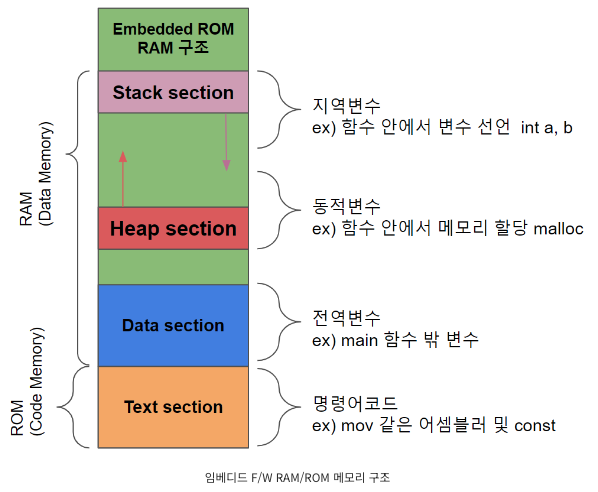

# 알고리즘 분류 코드
- DP
  - LIS : Longest Increasing Subsequence
  - LCS : Longest Common Subsequence
- BFS
- DFS
- BRTF : Bruteforce
- Greedy
- Tree
- BINS : Binary Search
- Graph
- STPH : Shortest Path
- SIM : Simulation, 구현
- TP : Two Pointer
- BT : Backtracking
- Hash
- String : 문자열 관련


<br>
<br>
<br>
<br>


# C++ Tips
### Headers
  - \<map>
    - map이 Red-Black Tree 구조라서 순회할때 중위 순회로 출력됨. 

      그래서 insert, erase마다 정렬이 일어나 search는 빨라도 삽입, 삭제는 느려짐.
    - 키 값 분포가 고르지 못하면 balancing 비용으로 성능 저하 가능.

      ```unordered_map```은 hash_table 기반이라 O(1). 물론 해시충돌 일어나면 O(n).
      ```cpp
      map<string, int> mp;
      mp["hi"] = 4; // insert 해도 됨.
      mp.insert({"hi", 4});
      mp.size();
      mp.erase("hi");
      auto it = mp.find("hi");
      if (it == mp.end()) {
        // not contain 확인
      }

      // 중위 순회
      for (map<string, int>::iterator i = mp.begin(); i != mp.end(); i++) {
        cout << i->first;
      }
      ```

    - map을 vector로 : 복사 생성자 사용

        ```cpp
        vector<pair<string, int>> v = { {"12", 1}, {"123", 2} };
        map<string, int> mp(v.begin(), v.end());
        ```
    - vector를 map으로 : 복사 생성자 사용

        ```cpp
        map<string, int> mp;
        vector<pair<string, int>> v(mp.begin(), mp.end());
        ```


  - \<set>
    ```cpp
    std::set<int> s;
    s.count(k); // 원소 k의 개수 
    s.insert(k); // return으로 pair<iter, bool> 나옴. 성공시 bool = true.
    s.erase(iter); // 제거하고 다음 원소 가리키는 iter 반환
    s.find(k); // k원소 가리키는 iter. 없다면 s.end() 반환.
    s.size(); 
    ```
  - \<algorithm> 
    - 깊은 복사 : ```std::copy(dest.begin(), dest.end(), source.begin())```

      - [memcpy의 메모리 Overlap 현상](https://wonillism.tistory.com/160) -> memmove 이용해야함.
      - 왜 ```std::copy``` 썼냐?

        1. memcpy는 memory overlap 현상 존재. 또한 vector는 복사 못함. 배열만 복사 가능.
        2. for 문으로 직접 변환하는 것보다 std::copy가 더 빠르다는 결과를 봤음. 물론 함수 호출의 overhead가 있겠지만, 개수가 많아질수록 함수호출이 차지하는 overhead 비율이 작아질 것이므로 std::copy를 사용.
    - 초기화 : ```fill(iter, iter, value)```

      ```cpp
      // vector 초기화
      vector<int> v(8);
      fill(v.begin(), v.end(), 1);
      vector<vector<int>> a(10, vector<int>(10, 1)); // 1로 초기화된 10x10
      vector<pair<int, int>> a[10]; // 0으로 초기화된 pair 벡터들의 배열
      // a[0].push_back({1, 1});

      // 배열 초기화 
      int a[8]{ 0, };
      fill(a, a + sizeof(a)/sizeof(int), 1);
      ```

      - 배열의 직접 초기화 예시

        ```cpp
        #include<iostream>
        #include<algorithm>

        using namespace std;

        void initArr(int arr[]);
        void initArr2(int* arr, int size);

        int main() {
            int T, C;
            int answer[4]{ 0, };

            cin >> T;
            answer[0] = 100;
            // 1. 틀림
            initArr(answer);
            // 2. 직접 초기화
            initArr2(answer, sizeof(answer)/sizeof(*answer));
            // 3. fill 함수 사용
            fill(answer, answer + sizeof(answer)/sizeof(*answer), 1);
            for(int i = 0; i < 4; i++) cout << answer[i];;
        }

        // // 틀림
        void initArr(int arr[]) {
            for(int i = 0; i < sizeof(arr)/sizeof(*arr); i++) arr[i] = 0;
        } // 배열의 첫 주소만 전달됨. 그래서 길이를 알 수 없다.

        // // 맞음
        void initArr2(int *arr, int size) {
            for(int i = 0; i < size; i++) arr[i] = 0;
        }
        ```

    - ```sort(v.begin(), v.end(), compare)``` : quick sort의 단점인 worst case에 O(N^2)인거를 고쳐서 O(nlogn) 보장. 비교함수 안주면 오름차순 정렬.

      ```cpp
      // 배열 정렬
      sort(a, a+100);
      ```
    - min, max
    - ```reverse(str.begin(), str.end())``` : string 뿐만 아니라 container들 다 사용 가능. iterator 넣어주면 됨. return 없음.

  - \<queue>
    ```cpp
    #include <iostream>
    #include <queue>
    #include <functional>    // greater, less
    using namespace std;
    int main() {
        priority_queue<int> pq;  // - >  priority_queue<int, vector<int>, less<int>> pq;
    
        // 우선순위 큐에 원소를 삽입 (push) 한다 
        pq.push(4);
        pq.push(1);
        pq.push(10);
    
        cout << "우선순위 큐 사이즈 : " << pq.size() << "\n";
        // 우선순위 큐가 비어 있지 않다면 while 문을 계속 실행
        while (!pq.empty()) {
            cout << pq.top() << '\n';
            pq.pop();
        }
        return 0;
    }

    struct Student { // 대문자로 시작하는거 주의 !!!
        int id;
        int math, eng;
        Student(int num, int m, int e) : id(num), math(m), eng(e) {}    // 생성자 정의

        // 그냥 점수에 상관 없이 학번기준 학번이 작은것이 Top 을 유지 한다
        bool operator<(const Student s) const {
            return this->id > s.id;
        }
    }; // 세미콜론(;) 붙이는거 주의 !!!
    
    int main() {
        priority_queue<Student> pq;  
    
        pq.push(Student(3, 100, 50));
        pq.push(Student(4, 90, 50));
        pq.push(Student(5, 70, 40));
        
    // 학번을 기준으로 작은 것이 먼저 출력이 된다 그 이유는 구조체 내부의 연산자 오버로딩에 있다
        while (!pq.empty()) {
            Student ts = pq.top(); pq.pop();
            cout << "(학번, 수학 , 영어 ) : " << ts.id << ' ' << ts.math << ' ' << ts.eng << '\n';
        }
    
        return 0;
    }
    ```


  - \<utility>
    - pair 구조체 (pair는 vector 헤더에 포함이라 보통 vector 헤더 포함해두기에 별도 import 필요 없음)


  - \<vector> [참고](https://blockdmask.tistory.com/70)
    ```cpp
    vector<int> v(3); // 0이 3개
    vector<int> v(3, -1); // -1이 3개
    vector<vector<int>> v(10, vector<int>(5, -1)); // -1로 10행 5열

    v.front(); 
    v.back();
    v.push_back(7);
    v.pop_back();
    v.erase(iter);
    vector<int>::iterator iter;
    for (iter = v.begin(); iter != v.end(); iter++) {
      cout << *iter << " ";
    } // v.end()는 마지막 원소보다 한 칸 뒤 위치 반환
    ```
  - \<cstdlib>
    - atof, atol, atoi : 문자열 -> double, long, int 형으로 변환
      - 근데 string header의 stoi가 더 빠름. C++11 이전이면 atoi 써야함.

        ```atoi``` : string -> char* -> int 바꾸는 것
        ```cpp
        string s = "111";
        const char* ch; // const datatype* = 진짜 참조만. ptr 역참조로 값 변환 X
        ch = s.c_str();
        int n = atoi(ch);
        // n = atoi(s.c_str());
        ```
    - calloc, malloc, free
    - abs, div : 절대값, 정수 나눗셈. abs 쓸거면 cmath header를 import


  - \<cmath>
    - ```abs(val)```
    - ```ceil(x), floor(x)``` : double 반환
    - ```log10(double)``` : 밑이 10인 로그값을 double로 반환
    - ```log(double)``` : 밑이 e인 로그값 double 반환
    - ```pow(x, y)``` : x ^ y 값 double 반환
    - ```sqrt(x)```


  - \<string>
    - __생성자 주의 ```string str(char[])``` : char배열의 맨 끝을 알리는 \0까지 string에 포함되어 생성됨. 그러므로 string 초기화시 생성자를 이용할때는 주의!!!__
    - ```size()``` 길이 구하기 : ```string.size() or string.length()``` 아래와 같은 차이점이 있긴 하지만 같은 값. capacity만 아니면 됨.
      - size() : 해당 string 객체가 사용하고있는 메모리 크기
      - length() : 문자열 길이

    - ```str.substr(pos, count)``` 부분 문자열 : count 만큼 pos에서부터 자르기.
    - ```str.erase(pos, count)``` 삭제 : pos부터 count만큼 지움.
    - Tokenizing : strtok() 함수 사용해도 됨. 
        ```cpp
        string line = "I am who I am and I have the need to be.";
        string delim = " ";
        vector<string> words{};

        size_t pos = 0;
        while ((pos = line.find(delim)) != string::npos)
        {
            words.push_back(line.substr(0, pos));
            line.erase(0, pos + delim.length());
        }
        ```
    - ```getline(cin, string)``` : 주어진 입력의 길이, 공백 상관없이 모든 문자열 받는 방법.
    - string::npos : ```string.find(target, start_idx)```에서 해당 위치 못찾으면 반환하는 -1 값 가지는 상수.
      - ```cout << std::npos``` 하면 ```std:npos가 static const size_t npos = -1```로 정의돼있어 unsigned인 size_t에 의해 -1이 unsigned long long의 max 값인 ```ULONG_MAX```, 1.8e19로 출력됨.

        따라서 find() 했을때, string::npos랑 비교하는 로직 추가해서 npos이면 -1 출력하게 로직 수정해야함.
    - int -> string : ```string st = to_string(100)```
    - string -> int : ```stoi(st)```


  - \<iomanip> : io manipulator 
    - std:setprecision() 함수를 통해 cout의 default 정밀도를 재정의.
      
      이걸로 안해도됨. 추가적인 header 필요 없이 ```cout<<fixed, cout.precision(3);```에서 설정 가능.
      
      ```cpp
      cout<<fixed; // 이거 해야 소수점 아래로만 precision 고정. 안하면 소숫점 위, 아래 포함 3자리임.
      cout.precision(3); // 소수 아래 3자리만 출력.
      ```   

  - \<tuple> 
    - tuple 클래스 사용
    - 보통은 아래와 같이 사용하므로 tuple 잘 안씀
      ```cpp
      pair<int, int> p1;
      pair<pair<int, int>, int> p2;
      
      p1 = {1, 2};
      p2 = {p1, 3};
      int a, b, c;
      ```

### Data Structures
- Hash
  - hash function

    \<functional>

    ```std::hash<datatype>```


    

### C++ 언어 특성
- 비교 연산자
  - ```==``` : 메모리 주소가 동일한지 비교
  - ```str1.compare(str2)``` : 문자열끼리 비교. 같으면 0, 다르면 -1 반환.


- 사칙 연산
  - division operator : ```/```
    - 연산 결과는 분모의 자료형을 따라간다.
    ```cpp
    int a = 3;
    int b = 4;
    float c;
    c = a / b; // 0. b가 int라서 division의 결과도 int형
    c = a / 4.; // 0.75
    ```


- 자료형
  - 중괄호 초기화 : ```int num{ 1 };``` 이렇게 중괄호로 초기화하는게 가장 현대적이고 이점이 있음. [참고](suji8448@naver.com) 

    1. 축소 변환시 오류 발생 
    
        ```int num {4,5};``` 이렇게 하면 error 발생. 

        다른 초기화 방식쓰면 ```int num = 4.5;``` 축소 변환 일어나 4 들어감. 이러면 compile 시점에서 못잡아주니 추후 큰일날 수 있음.
    2. overflow를 compile 시점에 잡아줌

        자료형보다 큰 범위 대입시 다른 초기화법은 overflow된 값 그대로 대입되지만, 중괄호 초기화는 compile 단계에서 잡아줌.
        
        ```cpp
        short num1(100000);
        short num2{ 100000 };
        cout << num1; // -31072
        cout << num2; // ERROR
        ```
    - 단점 : 2개의 인자받는 생성자 함수가 2개라면, 중괄호 초기화시 initializer_list로 생성하는 생성자 함수가 더 우선순위 갖게 됨. 직접 2개 arg 받는 생성자는 호출이 안됨. 괄호 초기화로 하면 호출 가능. [참고](https://choi-dan-di.github.io/cpp/brace-init/)

  - ```int``` : 4 byte. -21억 ~ 21억. 20억 넘어가면 ```long long``` 사용
    - INF를 21억이 아닌 1e9 또는 987654321로 선언하는 이유 : 문제풀다 int의 최대값으로 INF 선언할텐데, INF 끼리 더해지거나 곱해지면 overflow 발생할 수 있기에.
  
  - ```unsigned long long``` :  1.8e19. 아주 가끔 사용
  - floating point numbers
    - cout의 default는 6자리
    - float형 : 6~9자리. 7자리로 암기.
    - double형 : 15~18자리. 15자리로 암기.
    - long double : 15, 18, 33자리
  - Rounding errors
    - ```double d(0.1)``` 을 그냥 cout하면 precision이 6자리라서 0.1 출력되지만, 17자리로 setprecision()하면 맨 끝자리즈음 0으로 안떨어짐. 이진수로 0.1 무한히 표현하다보니 생기는 반올림 에러.


- Class
  - pair와 tuple : 각각 2개 또는 3개 값만 저장할 때. 
    ```cpp
    pair<int, int> pi;
    pair<int, int> pi2;
    tuple<int, int, int> tl;
    int a, b, c;

    pi = {1, 2}; // 또는 make_pair(1, 2);
    p2 = make_pair(1, 3);
    tl = make_tuple(1, 2, 3);
    tie(a, b) = pi; // 또는 a = pi.first, b = pi.second
    c = get<1>(tl);

    // 대소비교
    pi > pi2; // false. 첫째 원소 먼저 비교 후, 두번째 비교.
    ```


  - string
    - https://rebro.kr/53


- 메모리 구조
  

  - Stack : 지역 변수, 함수, 매개변수. 따라서 ```compile time```에도 크기 결정되고, ```run time```에도 크기 변경됨.
  - Heap : 동적 할당(malloc)으로 할당된 변수. ```run time```에 결정. 

    ```vector```가 내부적으로 heap 사용.
  - Data Section(Data segment, BSS(Block Started by Symbol) segment)
    - data segment : 0이나 NULL 아닌 값으로 초기화된 전역/static 변수
    - BSS segment : 초기화되지 않거나, 0, NULL로 초기화된 전역/static 변적. 굳이 이 둘을 구분한 것은 임베디드는 작은 ROM안에 프로그램 넣어야하는데 초기화되지 않은 BSS segment의 녀석들은 초기화된 값을 저장할 필요 없으니 그냥 이 변수가 있다!만 알려주면 되서 프로그램 용량 작아지는 효과.
  - Text(Code) Section : 코드들

  - const : ROM에 할당되므로 자주 호출되면 memory가 아니니 느려짐.
  - #define : 전처리기 중 하나이므로 compoile시 치환됨. 
    - 함수는 호출될때마다 memory에 있는 stack frame이라는 공간을 
    할당 받으므로 많은 함수를 작성하는 것은 좋지 않음.
    - #define으로 함수 작성해두면, 함수가 아니라 해당 명령어로 치환해서 실행하므로 함수 실행이 아닌, 그냥 주어진 연산을 진행해버림(for문이든, 사칙연산이든)
    - 따라서 간단한 함수들은 macro로 만들어 사용해 stack frame 차지를 줄이자.


- Call by reference
  - reference의 의미
    - 이미 존재하는 변수에 대해 다른 이름을 선언하는 것. 기존 변수를 공유함. 
    그래서 구조체 레퍼런스는 그냥 (.)으로 바로 접근할 수 있는 것임.

  - Array : 3가지 방법
    ```cpp
    int a[3] = {1, 2, 3}; 
    void go(int a[]){
      a[2] = 100; 
    } 
    void go2(int a[3]){ 
      a[2] = 1000;
    } // 이것도..
    void go3(int *a){ 
      a[2] = 10000;
    }

    int main(){
    go(a); cout << a[2] << '\n'; 
    go2(a); cout << a[2] << '\n'; 
    go3(a); cout << a[2] << '\n';
    }

    /*
    100
    1000
    10000
    */
    ```
  
  - Structure 
    ```cpp
    struct Car 
    {
      int num;
      double gas;
    } 

    void Show(Car& c);

    int main() {

    }

    void Show(Car& c) {
      cout << c.num << c.gas;
    }

    void Show2(Car* c) {
      cout << c->num << c->gas << (*c).num; 
    } // 구조체 포인터면 멤버 접근시 화살표로. 아님 역레퍼런스(*)
    ```


- Array
  - 할당 가능한 크기 : 보통 int 기준 100000, 10^5 정도. 10^6은 SEGMENTATION FAULT 발생. 범위 벗어난 메모리 참조하려는 에러.<br>
    -> vector 이용해서 할당받아야함.

  - 원소 개수 : sizeof(arr) / sizeof(datatype) 해야 개수 나옴. vector는 size만 해도 나오지만.

  - 초기화
    - 지역 변수 : ```int arr[3];``` 사이즈만 지정하면 0으로 초기화되는줄 알았는데, 직접 해보니 아님. ```int arr[3] = { 0, };``` 이렇게 초기화. {-1,} 이렇게 하면 첫 원소만 -1로 초기화됨. 위험.

      0 말고 다른수로 초기화 하려면 \<algorithm\> header의 ```std::fill_n(arr, 변경하려는 개수, value)``` 사용

      ```std::fill(start address, end address, value)``` 이거로 통일.

      ```cpp
      int arr[5][5];
      fill(arr[0], arr[0] + 25, 1);
      // 또는
      fill(&arr[0][0], &arr[4][5], 1);
      ```


    - 동적 할당
      - new 사용 : ```int * arr = new int[5]``` 이렇게 동적 할당 가능.


- Inline 함수
  - #define과 같은 매크로 함수는 편하지만, 디버깅 어렵고 괄호 잘 안치면 연산순서로 인해 의도치 않은 결과를 얻을 수 있음.
  - 매크로 함수처럼 실제 동작은 해당 함수를 실행하는 것이지만, 전처리기가 바로 치환하는 것이 아니라, compiler가 실제 함수 실행처럼 인식해 실행함.
  - argument의 type도 확인하므로 __매크로 함수보단, 인라인 함수를 사용해라__
  ```cpp
  #include <stdio.h>
  __inline int square(int a) { return a * a; }
    int main(int argc, char **argv) {
      printf("%d", square(3));

    return 0;
  }
  ```


- Pointer
  - int\*과 char\*의 차이점 : 포인터 연산에서 차이 있음.
    - 포인터 변수 + 1면하면 전자는 4 byte, 후자는 1 byte씩 이동. 그래서 int, char형 배열에 대해 + 1씩하면 다음 원소 접근가능
  - pointer의 크기는 32bit면 4B, 64bit면 8B로 고정! 자료형에 상관없이! 왜냐면 주소의 크기만 담으면 되니까 컴터의 최대 비트수가 표현가능한 주소의 범위니까.
  - ```datatype* const```와 ```const datatype*``` 차이점
    - 전자 : pointer가 가리키는 주소를 고정. 즉, 다른 변수의 주소를 가리킬 수 없음.
      ```cpp
      int main() {
        int a = 7, b = 10;
        int* const ptr = &a;
      
        // ptr가 담고 있는 주소값 변경하기(다른 변수 가리키기)
        ptr = &b; // Error
        a = 10; // 가능
        *ptr = 30; // 가능
      
        return 0;
      }
      ```
    - 후자 : pointer로 pointer가 가리키는 변수의 값을 변경할 수 없음. __진짜 참조만 할 수 있게 !!__
      
      _물론 해당 변수 값 자체를 직접 변경할 수는 있지만, ```*ptr = 3``` 이렇게 변경은 안된다는 말임._
      ```cpp
      int main() {
        int a = 7;
        const int *ptr = &a;
      
        // ptr이 가리키는 값 변경하기
        *ptr = 3; // Error

        a = 10; // 가능. ptr 이용해서 바꾸는게 아니라 직접 바꾸는 거니까.
      
        return 0;
      }
      ```


  - pointer 끼리 연산
    - 덧셈 : 안됨. ptr + integer 이건 가능. ptr 자료형 크기만큼 이동
      ```cpp
      int[10] arr;
      int* ptr = arr;
      std::cout << *(ptr + 2); // 3번째 원소, 0 나옴
      ```
    - 뺄셈 : 데이터 개수 세는 기능.


- 입출력 빠르게
  - [여러 상황의 입력 받기](https://dbstndi6316.tistory.com/33)
  - 입력

      ```cpp
      ios_base::sync_with_stdio(false);
      cin.tie(NULL);
      ```
    - 멀티 쓰레드환경에서 sync를 false하면 c의 stdio와 cpp의 iostream을 동기화 비활성화. thread unsafe라 문제 생김.근데 대부분의 PS는 signle thread니까 가능.
    - (prinft, scanf)랑은 혼용해서 쓰면 안됨. thread unsafe되니까. [참고](https://jaimemin.tistory.com/1521)
  - 출력
    - endl보단 '\n'로 출력.
    - endl은 개행을 출력 버퍼 기록 후 flush하지만, '\n' 은 출력 버퍼에 기록만 해두기에 매번 flush하면 느림.
  - 입출력 묶음 풀기 ```cin.tie(NULL), cout.tie(NULL)``` 
    - 원래 입력요청 받기 전에 출력 작업이 있었으면 출력 버퍼를 flush 함. 근데 tie(NULL)을 통해 입출력 묶음 풀면 flush 안하고 한번에 모아서 출력 하니까 빠름.
      ```cpp
      /*
      //입력
      //출력
      //입력
      //출력
      */
      #include<iostream>
      using namespace std;

      int main(void){
        ios_base::sync_with_stdio(false);

          int t,num1,num2;
          cin>>t;

          for(int i=0;i<t;i++){
              cin>>num1>>num2;
              cout<<num1+num2<<"\n";
          }
      }

      /*
      //입력
      //입력
      //출력
      //출력
      */
      #include<iostream>
      using namespace std;

      int main(void){
        cin.tie(NULL); //입출력 묶음 해제
          ios_base::sync_with_stdio(false);

          int t,num1,num2;
          cin>>t;

          for(int i=0;i<t;i++){
              cin>>num1>>num2;
              cout<<num1+num2<<"\n";
          }
      }
      ```
- 객체 참조자
  - cpp는 매개변수로 객체 전달시, 복사하는게 default. 객체& 이런 형태로 전달하면 해당 객체 그대로 reference.
  ```cpp
  #include <iostream>

  class Animal {
  public:
      int value;

      Animal(int val) : value(val) {
      }
  };

  int functionA(Animal a) {
      a.value = a.value * 2;
      return a.value;
  }

  int functionB(Animal &a) {
      a.value = a.value * 2;
      return a.value;
  }

  int main() {
      Animal a(5);

      int resultA = functionA(a);
      int resultB = functionB(a);

      std::cout << "Result from functionA: " << resultA << std::endl;
      std::cout << "Result from functionB: " << resultB << std::endl;
      std::cout << "Value of a after calling functionA and functionB: " << a.value << std::endl;

      return 0;
  } 
  ```
    